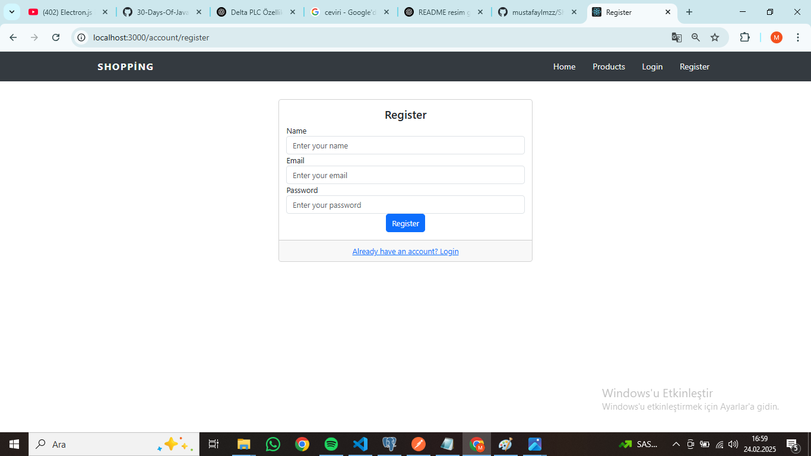
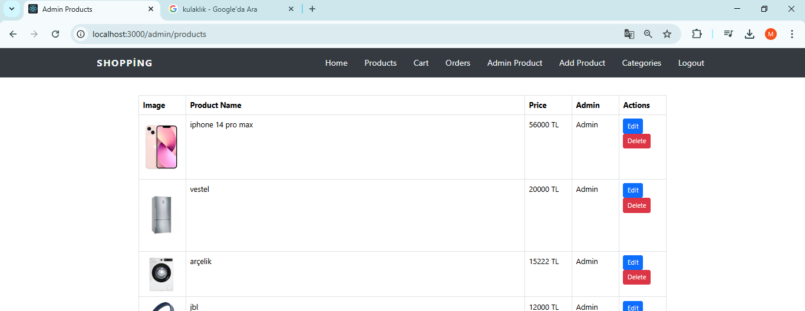
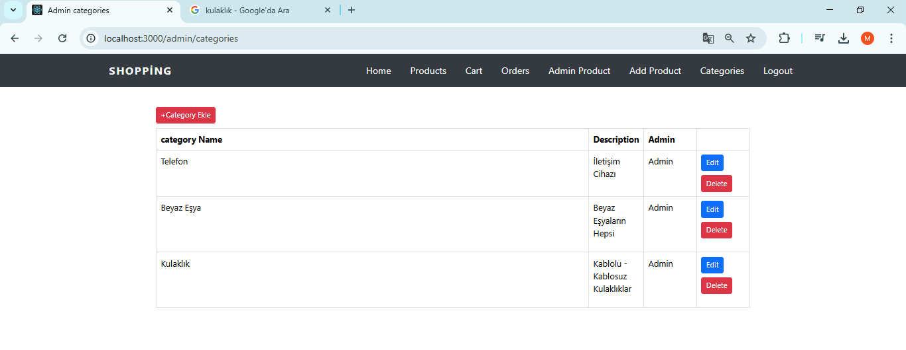
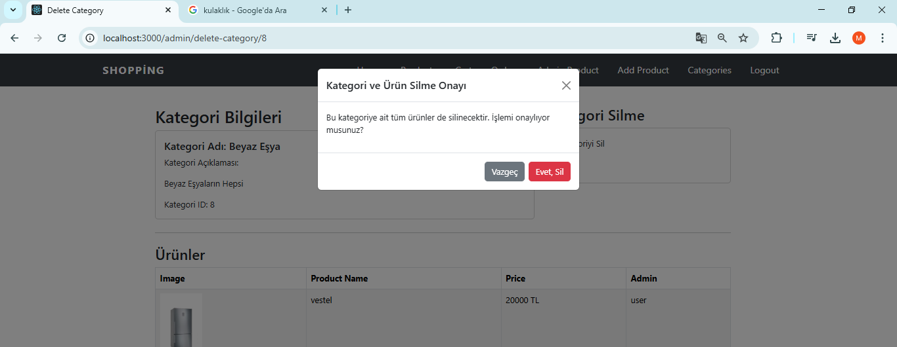
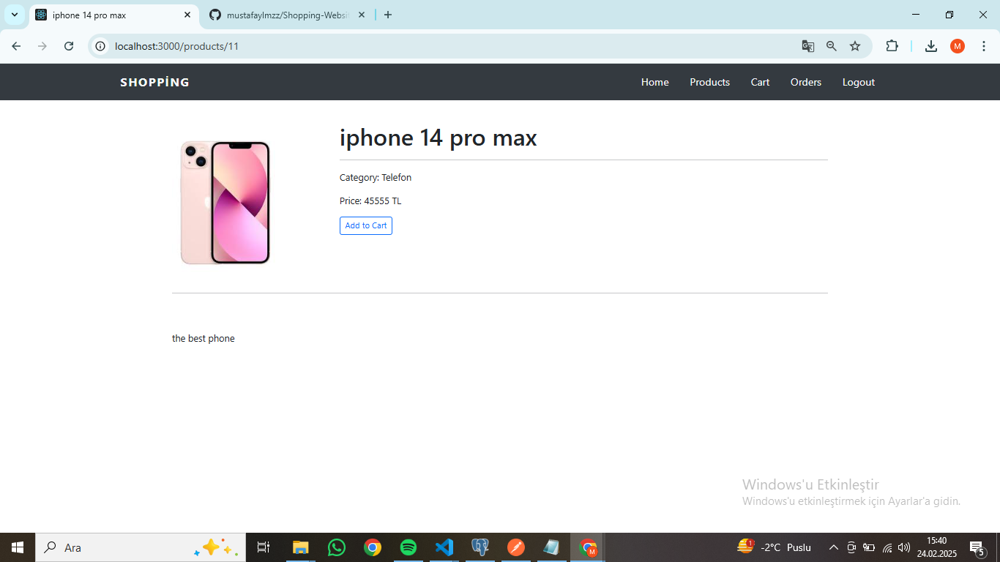
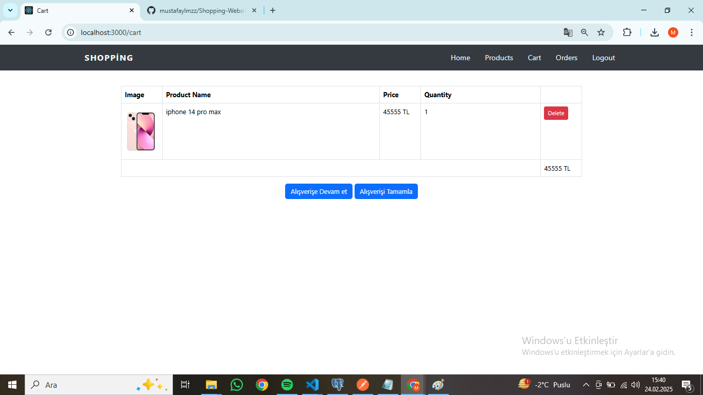

# Shopping-Website

This is a backend project developed using **Node.js** and **Pug template engine**. It provides a full-stack shopping website with an admin panel to manage products, categories, and users.

## Features

- **Login & Register System**: Secure login and registration functionality.
- **Admin Panel**: 
  - Manage products, categories, and users.
  - Add, edit, and delete products.
  - View user orders and details.
- **User Panel**: 
  - View product details.
  - Add products to the cart.
  - Manage and view orders.

## Tech Stack

- **Backend**: Node.js, Express.js
- **Frontend**: Pug Template Engine
- **Database**: PostgreSQL
- **Authentication**: Csurf

## Login-Register Screens: 
![Login] (public/ss/lgns.png)

## Project Admin Panels: 

## Project User Panels:  

